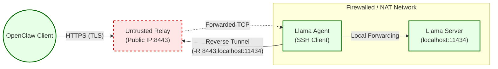

# LobsterRelay: OpenClaw-Llama End-to-End Encrypted Relay Protocol Specification

## 1. System Overview & Motivation

This specification defines a zero-trust relay architecture for exposing local LLM instances behind NATs. The architecture uses Reverse SSH tunneling as an encrypted transport conduit. The public relay functions as an opaque routing overlay, incapable of inspecting application-layer traffic.

## 2. Topology & Network Architecture



## 3. Data Plane: SSH-Multiplexed Transport

The node daemon binds a public relay port to the local LLM interface:

```
OpenClaw Client  Relay Public Interface  SSH Tunnel  Localhost:11434 (TLS Terminated)
```

## 4. LobsterRelay Daemon: Reference Implementation

The LobsterRelayDaemon is part of the ClawBits OpenClaw plugin and is initiated only if the machine runs Ollama.

### 4.1 Systemd Configuration

Install at `/etc/systemd/system/lobster-relay.service`:

```ini
[Unit]
Description=LobsterRelay Llama Node Daemon
After=network.target

[Service]
Type=simple
User=tunnel_user
ExecStart=/usr/bin/python3 /opt/lobster/lobster_relay_daemon.py
Restart=always
EnvironmentFile=/etc/lobster/relay.conf
ProtectSystem=full
CapabilityBoundingSet=CAP_NET_BIND_SERVICE
NoNewPrivileges=true

[Install]
WantedBy=multi-user.target
```

### 4.2 Python Daemon Implementation

```python
import subprocess, time, requests, logging, signal, sys, os
logging.basicConfig(level=logging.INFO)
logger = logging.getLogger("LobsterRelayDaemon")

class LobsterRelayDaemon:
    def __init__(self, relay_ssh_host, relay_ssh_user, relay_api_url, local_port, ssh_key_path, known_hosts_path, organization_id, api_key):
        self.relay_ssh_host, self.relay_ssh_user, self.relay_api_url = relay_ssh_host, relay_ssh_user, relay_api_url
        self.local_port, self.remote_port, self.ssh_key_path = local_port, None, ssh_key_path
        self.known_hosts_path, self.organization_id, self.api_key = known_hosts_path, organization_id, api_key
        self.tunnel_process = None
        signal.signal(signal.SIGINT, self.shutdown)
        signal.signal(signal.SIGTERM, self.shutdown)

    def register_with_relay(self):
        response = requests.post(f"{self.relay_api_url}/api/v1/tunnel/register",
                                 json={"organization_id": self.organization_id, "api_key": self.api_key}, timeout=5)
        response.raise_for_status()
        self.remote_port = response.json().get("assigned_port")

    def start_tunnel(self):
        if not self.remote_port: return False
        cmd = ["ssh", "-N", "-R", f"{self.remote_port}:localhost:{self.local_port}",
               "-i", os.path.expanduser(self.ssh_key_path), "-o", "ServerAliveInterval=30",
               "-o", "ExitOnForwardFailure=yes", "-o", "StrictHostKeyChecking=yes",
               "-o", f"UserKnownHostsFile={os.path.expanduser(self.known_hosts_path)}",
               f"{self.relay_ssh_user}@{self.relay_ssh_host}"]
        self.tunnel_process = subprocess.Popen(cmd)
        return True

    def monitor_tunnel(self):
        while True:
            if not self.tunnel_process or self.tunnel_process.poll() is not None:
                try:
                    self.register_with_relay()
                    if self.start_tunnel(): time.sleep(2)
                except Exception as e:
                    logger.error(f"Restart failed: {e}"); time.sleep(10)
            time.sleep(5)

    def shutdown(self, signum, frame):
        if self.tunnel_process and self.tunnel_process.poll() is None:
            self.tunnel_process.terminate()
        sys.exit(0)

if __name__ == "__main__":
    DAEMON = LobsterRelayDaemon("relay.example.com", "tunnel_user", "https://relay.example.com", 11434, "~/.ssh/id_rsa_relay", "~/.ssh/relay_known_hosts", "org_01", "sk_live_example")
    DAEMON.monitor_tunnel()
```

## 5. Organization-Isolated PKI (Self-signed Certificates)

To ensure E2EE, organizations may use a self-signed certificate pair instead of a private CA. The self-signed certificate is generated by the organization and distributed to clients for trust.

- **Self-signed certificate generation:** create a certificate and private key valid for the relay host. Example (10 year RSA):

  ```sh
  openssl req -x509 -nodes -days 3650 -newkey rsa:4096 \
    -keyout organization_self_signed.key \
    -out organization_self_signed.crt \
    -subj "/CN=relay.example.com"
  ```

- **Daemon configuration:** place the certificate and key on the relay/daemon host and configure the daemon to use them (paths are examples):

  - `/etc/lobster/organization_self_signed.crt`
  - `/etc/lobster/organization_self_signed.key`

- **Client trust:** distribute `organization_self_signed.crt` to OpenClaw clients and configure clients to trust it when calling the relay.

- **Invocation (client):** use the certificate file when invoking the control API:

  ```sh
  curl --cacert organization_self_signed.crt -X POST https://relay.example.com:P/api/generate
  ```

- **Renewal / rotation:** regenerate a new certificate and roll it out to clients and the daemon before expiry.

## 6. Infrastructure: Relay Server Specifications

### 6.1 Data Plane

Append to `/etc/ssh/sshd_config`:

```ini
Match User tunnel_user
    GatewayPorts clientspecified
    AllowTcpForwarding yes
    PermitTunnel no
    ForceCommand echo 'Restricted LobsterRelay Data Plane.'
```

### 6.2 Control Plane (API)

FastAPI webhook for discovery and port allocation:

```python
from fastapi import FastAPI, HTTPException
app = FastAPI(title="LobsterRelay Control Plane")
@app.post("/api/v1/tunnel/register")
async def register_tunnel(reg: dict):
    if reg.get("api_key") != "sk_live_example": raise HTTPException(401)
    return {"assigned_port": 10000}
```

## 7. Scalability: Multitenancy

- **Isolation:** `sshd_config` must dynamically construct Match User blocks enforcing PermitListen P per organization.
- **Allocation:** Control Plane manages the range.
